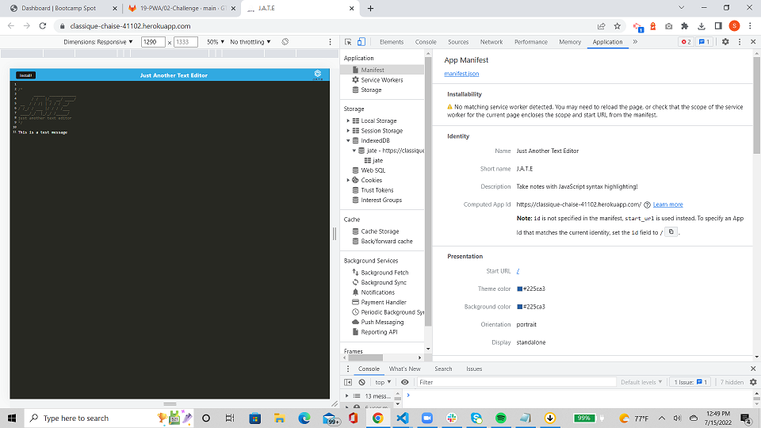
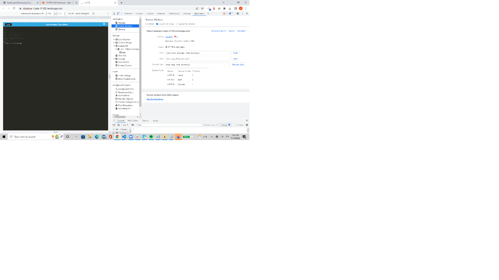
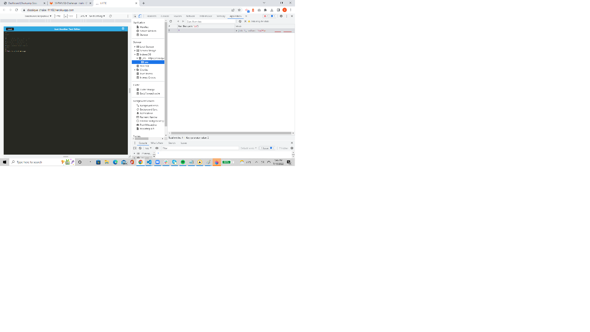

# Progressive Web Applications (PWA) Text Editor

## Description

This is a progressive web application (PWA) that is a text editor that runs in a browser.  It is a single page web application that features several data persistence techniques that serve as redundancy in case one of the options isn't supported by the browser, or if the application is offline.  These techniques include using webpack, using babel to translate the javascript to lower versions, using a local database to store data when the application is offline, and using a service worker to cache data locally.               

The application was built using a starter code that was provided.  The application is deployed to Heroku.

## Table of Contents

- [Screenshots and Links](#screenshots)
- [Acceptance Criteria](#acceptance)
- [What I Learned](#learned)
- [Credits](#credits)

## ScreenShots

Below is a series of screenshots that show the application in Heroku, as well as show the state of the application through the developer tools in the browser.

J.A.T.E Screenshot on Heroku

Manifest JSON

Service Worker

Indexed DB storage

The code is in the [GitHub Repository](https://github.com/stephencurrie/pwa-text-editor)

## Acceptance

The following were the acceptance criteria for the project:

- [x] When I open my application in my editor, I see a client server folder structure
- [x] When I run `npm run start` from the root directory, my application starts up the backend and serves the client
- [x] When I run the text editor application from my terminal, my JavaScript files have been bundled using webpack
- [x] When I run my webpack plugins, I have a generated HTML file, service worker, and a manifest file
- [x] When I use next-gen JavaScript in my application, the text editor still functions in the browser without errors
- [x] When I open the text editor, IndexedDB has immediately created a database storage
- [x] When I enter content and subsequently click off of the DOM window, the content in the text editor has been saved with IndexedDB
- [x] When I load my web application, I have a registered service worker using workbox
- [x] When I register a service worker, I have my static assets pre cached upon loading along with subsequent pages and static assets
- [x] When I deploy to Heroku, I have proper build scripts for a webpack application

## Learned

The following is a list of things I learned:

- How to use client/server file structure
- How to use webpack to package code and dependencies
- How to use Babel to make javascript accessible in older browsers
- How to save data to a local database to make it accessible offline
- How to cache data locally to improve performance and make it accessible offline
- How to generate a manifest json file
- How to use concurrently

## Credits
I want to thank our instructor Trey Eckels as he provided some sample code and additional help in completing the application.

I want to thank Simon Rennocks, my tutor, who also helped with some of the code.