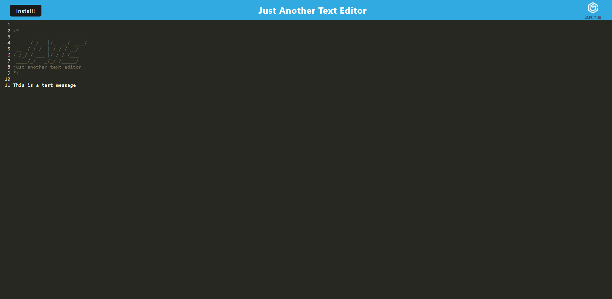

# Progressive Web Applications (PWA) Text Editor

## Description

This is a progressive web application (PWA) that is a text editor that runs in a browser.  It is a single page web application that features several data persistence techniques that serve as redundancy in case one of the options isn't supported by the browser, of if the application is offline.  These techniquest include using babel to translate the javascript to lower versions, using a local database to store data when the application is offline, and using a service worker to cache data locally.               

The application was built using a starter code that was provided.  The application is deployed to Heroku.

## Table of Contents

- [Screenshots and Links](#screenshots)
- [Acceptance Criteria](#acceptance)
- [What I Learned](#learned)
- [Credits](#credits)

## ScreenShots

Below is a series of screenshots that show the application in Heroku, as well as show the state of the application through the developer tools in the browser.

Here is a video of what the command prompts look like, the successful tests being run, and the html it creates. [Video](https://drive.google.com/file/d/1DklfrO6np96KN67PQs_tejeHCTtDmjVk/view)

The code is in the [GitHub Repository](https://github.com/stephencurrie/teamprofilegenerator)

## Acceptance

The following were the acceptance criteria for the project:

- [x] When I am prompted for my team members and their information, an HTML file is generated that displays a nicely formatted team roster based on user input
- [x] When I click on an email address in the HTML, my default email program opens and populates the TO field of the email with the address
- [x] When I click on the GitHub username, that GitHub profile opens in a new tab
- [x] When I start the application, I am prompted to enter the team manager’s name, employee ID, email address, and office number
- [x] When I enter the team manager’s name, employee ID, email address, and office number, I am presented with a menu with the option to add an engineer or an intern or to finish building my team
- [x] When I select the engineer option, I am prompted to enter the engineer’s name, ID, email, and GitHub username, and I am taken back to the menu
- [x] When I select the intern option, I am prompted to enter the intern’s name, ID, email, and school, and I am taken back to the menu
- [x] When I decide to finish building my team, I exit the application, and the HTML is generated

## Learned

The following is a list of things I learned:

- How to use object oriented coding
- How to use classes and sub classes to pass data between files
- How to use Test Driven Development
- How to use jest to test

## Credits
I want to thank our instructor Trey Eckels as he provided some sample code and additional help in completing the application.

I want to thank Simon Rennocks, my tutor, who also helped with some of the code.